# Mini Project: Creating a VPC on AWS Management Console

## Purpose
In this mini project, I will demonstrate how to create a Virtual Private Cloud (VPC) on AWS using the AWS Management Console. The project will guide you through defining a VPC and configuring its basic settings, including adding a subnet to make the VPC functional.

## Objectives:
1. Create VPC
2. Add subnet

## Task 1: Create a VPC
- Log in to the AWS Management Console
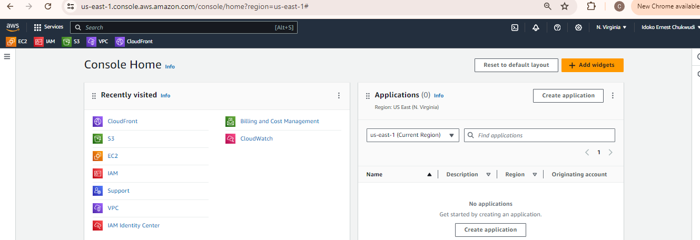

- In the AWS Management Console, type "VPC" in the search bar at the top and select "VPC" from the dropdown list.
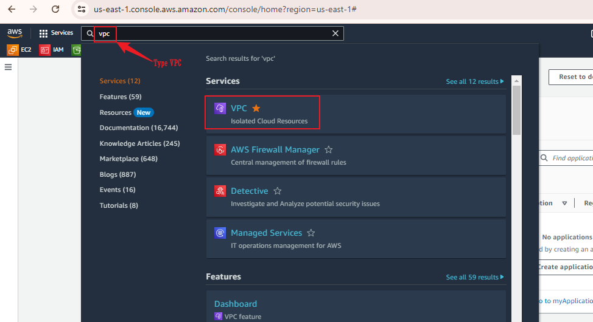

- Once in the VPC Dashboard, click on "Your VPCs" in the left navigation pane.
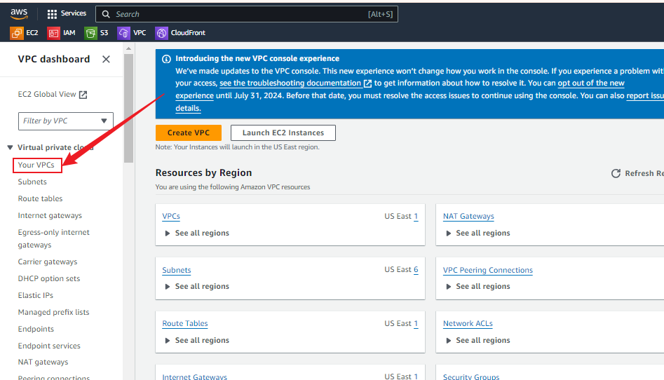

- Click the "Create VPC" button on the top right of the VPC Dashboard.
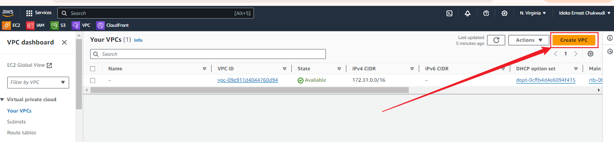

- Fill in the VPC Details
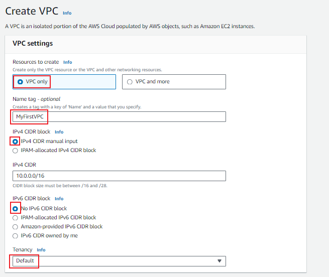

- After filling in the details, click the "Create VPC" button at the bottom right corner of the page.
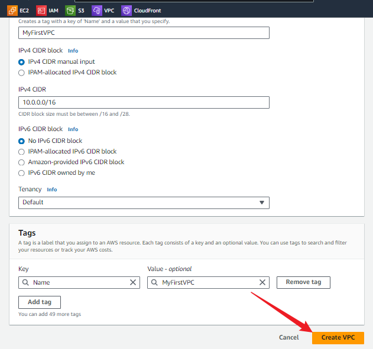

- You should see a confirmation message that your VPC has been created successfully.
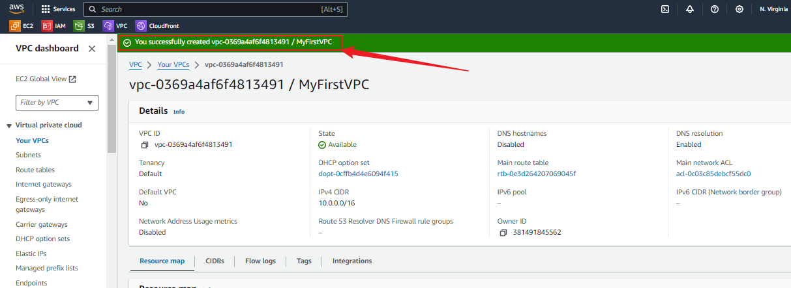

- In the VPC Dashboard, under "Your VPCs," you should see your newly created VPC listed with the details you provided.
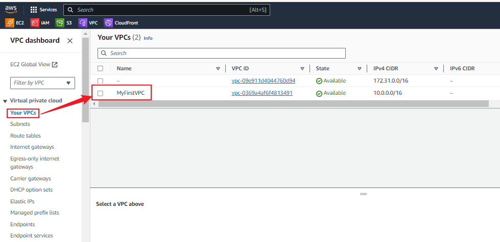

## Task 2: Adding Subnets to Your VPC
To make the VPC functional, you need to add subnets. Here’s how:

- In the VPC Dashboard, click on "Subnets" in the left navigation pane.
- Click the "Create subnet" button.
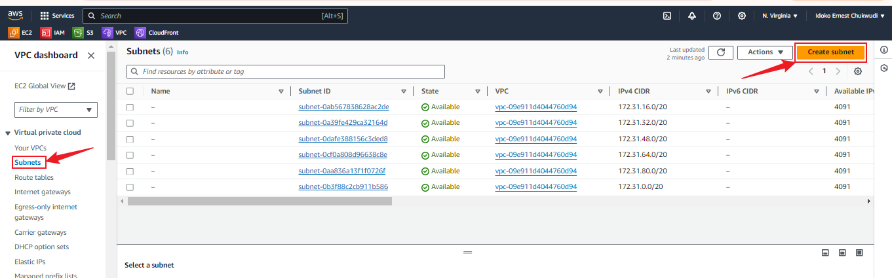

- Fill in Subnet Details
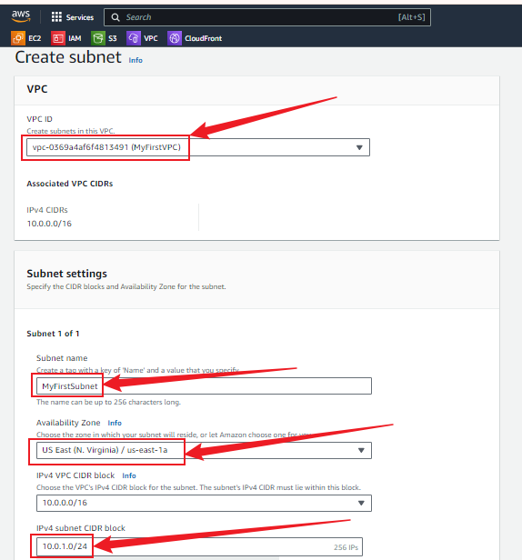

- Click the "Create subnet" button.
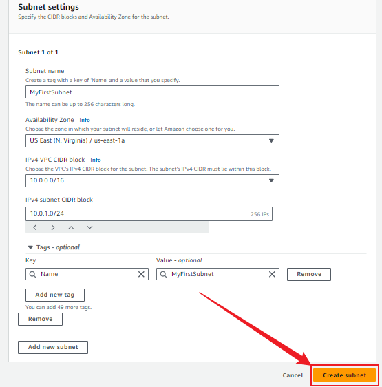

- You should see a confirmation message that your subnet has been created successfully. 
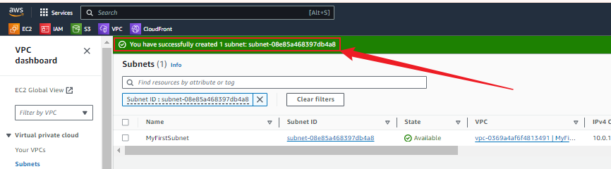

## Summary
In this mini-project, I have successfully created a Virtual Private Cloud (VPC) on AWS using the AWS Management Console. I followed a step-by-step process to define the VPC and configured its basic settings. Additionally, I added a subnet to my VPC, making it functional and ready for further configurations. This demonstrates my understanding of the foundational networking components within AWS.

## Importance of a VPC in AWS
A Virtual Private Cloud (VPC) is a crucial component of AWS that allows you to provision a logically isolated section of the AWS cloud. Here are some key points highlighting its importance:

### Enhanced Security:

- **Isolation:** VPCs provide a high level of isolation by creating a private network within the AWS cloud.
- **Access Control:** You can control inbound and outbound traffic to and from your resources using security groups and network ACLs.
- **Subnets:** By creating public and private subnets, you can isolate and control the exposure of your resources.
### Customizable Network Configuration:

- **IP Addressing:** You can define your own IP address range, subnets, and route tables.
- **VPN and Direct Connect:** VPCs allow you to securely connect your on-premises network to AWS using VPN or Direct Connect.
### Resource Management:

- **Elasticity:** VPCs enable you to manage and scale your AWS resources efficiently.
- **Load Balancing:** Integrate with AWS services like Elastic Load Balancing (ELB) to distribute traffic among your resources.
### Compliance and Governance:

- **Data Protection:** By controlling where and how your data is accessed, VPCs help meet compliance and regulatory requirements.
- **Monitoring and Logging:** AWS provides tools like VPC Flow Logs to monitor and log network traffic.

By creating a VPC, I have taken a significant step towards securing and managing my AWS resources effectively. A well-configured VPC forms the backbone of a robust cloud infrastructure, ensuring my applications and data are secure, scalable, and compliant with organizational and regulatory requirements.